# CMakeHelper V2

A small extension that turns simple json configs into CMake build files.

In order to use CMake-Helper in VsCode you need to install the extension.

## Installation

Until the official release you can download the .vsix binaries from the releases.

How to install an extension using a .vsix file can be found on the official [documentation page](https://code.visualstudio.com/docs/editor/extension-marketplace#_install-from-a-vsix).

## TLDR
1. Use this command in the VsCode [Command Palette](https://code.visualstudio.com/docs/getstarted/userinterface#_command-palette).
```
CMakeHelper: Initialize
```

2. Follow the step presented to you. 
3. Use the fully specified json config file from the [wiki](wiki/CMakeHelper-full-json-config-file) to configure the rest of the project

# How to use

This paragraph will explain how to create your first project using CMakeHelper.

wiki/CMakeHelper-full-json-config-file

## Initialize

To Initialize CMakeHelper for the first time use the, initialize command in the VsCode [Command Palette](https://code.visualstudio.com/docs/getstarted/userinterface#_command-palette).

```
CMakeHelper: Initialize
```

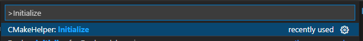

## Creating a project
After initialization you will be asked if you want to create a **Root Project**.

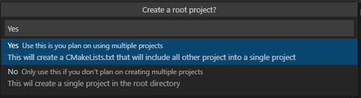

If you are planning on creating a bigger project that will consist of multiple projects select **YES**

If you just want to create a single project select **NO** and continue to [configuring a single project](#configuring-a-single-project).


### Root project name

When using a root project, you will be asked to give the root project a name.

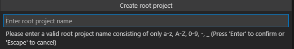

### Root project location

After setting the name, you will be asked to give the location where the entire project will be located.

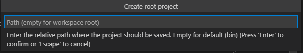

**Well done! You have configured the root project**

---

## Configuring a single project

When configuring/creating a project you will be asked to give the project a name

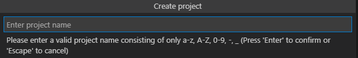

### Location

After setting the name of the project you will be asked where the project should be generated (when using a **root project** this will be default to the project's name).

The location can be any **relative directory** in the workspace. If it does not exist yet it will be created.

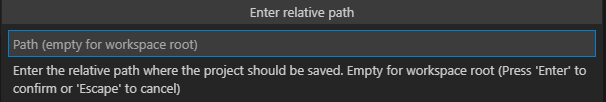

### The project type

Next you'll be asked to choose a project type. You can choose from:
 - Executable
 - Static Library (.lib)
 - Shared Library (.dll)

The will determin the type of binary that will be create when building the project.

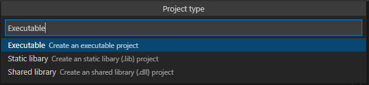

### Project language

After setting the type of project, you'll be asked what languages you want to use in the project either C or C++ or both.

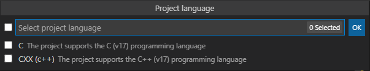

### Source and include directory

Next we need to know the location of your source files and include file, these can be any directory in the to be created project folder.

By default these will be:
 - Source -> src
 - Incluce -> include

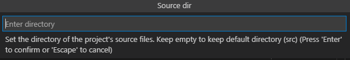
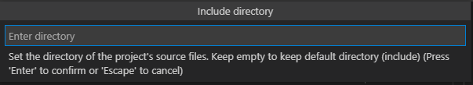

### Supported platforms

At last you'll be asked what platforms you want to support. These can be:
 - Win32 (Windows)
 - Unix (Linux)
 - MacOS (Apple)

You can choose just one or a combination of the three.

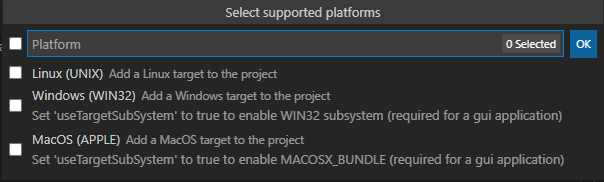

---

**Well done! You have configured the project**
---
You should be able to find the CMakeLists.txt in the location specified in the second step. 

You should also be able to find a .cmh file. This is the configuration file that holds the entire configuration of your CMake project